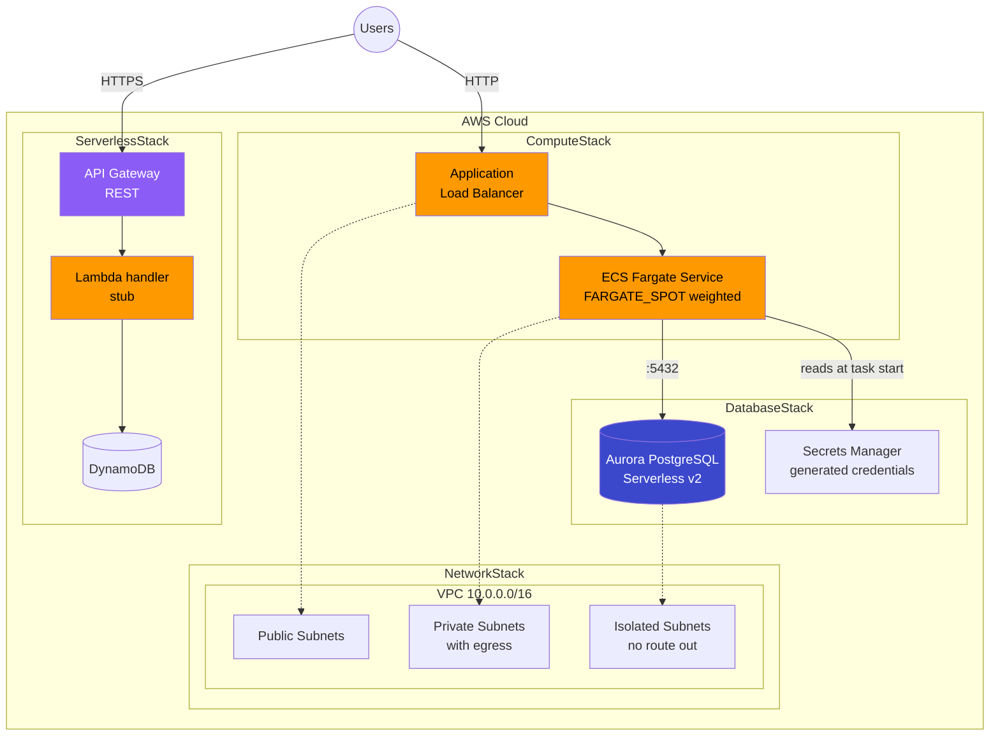
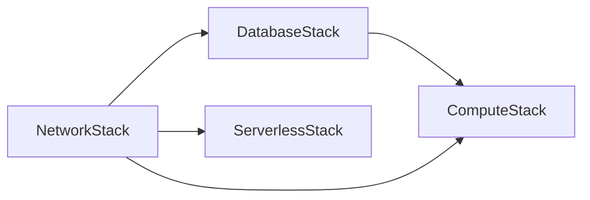

# AWS CDK Patterns

[](https://github.com/morgandt-reed/aws-cdk-patterns/actions/workflows/ci.yml)
[](https://opensource.org/licenses/MIT)
[](https://aws.amazon.com/cdk/)
[](https://www.typescriptlang.org/)

Four CDK stacks in TypeScript — network, database, compute and serverless —
wired together as one app with per-environment configuration.

`npm ci && npm run build && npm run lint && npm test -- --coverage && npx cdk synth --all`
is what CI runs, and it passes. Coverage is enforced by a threshold in
`jest.config.js`; nothing in the workflow is marked `continue-on-error`.

Not included: no CloudFront, WAF, ACM certificate, Cognito, SQS, SNS, Kinesis,
Step Functions or ElastiCache. The stacks below are the whole repository.

## Architecture

### What the four stacks actually build



The ALB listens on **HTTP only**. Adding HTTPS needs an ACM certificate and a
domain, neither of which this repository has; wire up `certificate` and
`redirectHTTP` on the Fargate pattern before putting it in front of anything real.

### Stack dependencies



Dependencies run one way only, which is not free: ComputeStack takes the
database's security group ID, endpoint and secret ARN as **plain values**, not
as the `DatabaseCluster` construct. Passing the construct and calling
`database.connections.allowFrom(service, ...)` reads better but puts the ingress
rule in DatabaseStack while referencing ComputeStack's security group, and
`cdk synth` fails with «DependencyCycle». `test/app.test.ts` synthesizes all
three environments to keep that from coming back.

## Features

- **Typed environment config** — `lib/config/environments.ts` defines dev,
  staging and prod; every stack takes its slice as a typed prop, so a missing
  field is a compile error rather than a deploy-time surprise
- **Environment-derived safety settings** — Aurora `deletionProtection` and
  `RemovalPolicy` follow `backupRetention`, and the DynamoDB table's removal
  policy follows a `retainData` flag, so prod data is retained and dev is not
- **Aurora Serverless v2 in isolated subnets** with credentials generated into
  Secrets Manager and injected into the Fargate task at start
- **Weighted FARGATE_SPOT** with a deployment circuit breaker that rolls back
- **36 `Template` assertion tests** across all four stacks and the VPC construct,
  with 100% coverage and a 90% floor enforced in CI

## Tech Stack

- **CDK**: aws-cdk-lib 2.120+
- **Language**: TypeScript 5.3
- **Node.js**: 20.x LTS
- **Testing**: Jest + `aws-cdk-lib/assertions`
- **Linting**: ESLint 9 flat config with typescript-eslint. No Prettier.

## Project Structure

```
.
├── README.md
├── cdk.json
├── package.json
├── tsconfig.json
├── bin/
│   └── app.ts                    # CDK app entry point
├── eslint.config.js
├── jest.config.js
├── bin/
│   └── app.ts                    # CDK app entry point
├── lib/
│   ├── constructs/
│   │   └── vpc-construct.ts      # The only L3 construct
│   ├── stacks/
│   │   ├── network-stack.ts
│   │   ├── database-stack.ts
│   │   ├── compute-stack.ts
│   │   └── serverless-stack.ts
│   └── config/
│       └── environments.ts       # Typed per-environment configuration
├── test/
│   ├── app.test.ts               # Whole-app synth, dependency-cycle regression
│   ├── constructs/
│   │   └── vpc-construct.test.ts
│   └── stacks/                   # One suite per stack
└── .github/
    └── workflows/
        └── ci.yml
```

## Quick Start

### Prerequisites

- Node.js 20.x
- AWS CLI configured
- AWS CDK CLI: `npm install -g aws-cdk`

### Installation

```bash
# Clone repository
git clone https://github.com/morgandt-reed/aws-cdk-patterns.git
cd aws-cdk-patterns

# Install dependencies
npm install

# Bootstrap CDK (first time only)
cdk bootstrap aws://ACCOUNT_ID/REGION

# Synthesize CloudFormation
cdk synth

# Deploy
cdk deploy --all
```

### Development Commands

```bash
# Build TypeScript
npm run build

# Run tests
npm test

# Watch mode
npm run watch

# Lint
npm run lint

# CDK commands
cdk diff       # Show changes
cdk deploy     # Deploy stacks
cdk destroy    # Tear down
```

## What each stack contains

### NetworkStack — `VpcConstruct`

The one reusable L3 construct in the repo. Three subnet tiers, NAT gateway count
configurable down to zero, flow logs optional, S3 and DynamoDB gateway endpoints
(both free).

```typescript
const vpc = new VpcConstruct(this, 'Vpc', {
  maxAzs: 3,
  natGateways: 1,      // 0 in dev is the single biggest cost lever
  enableFlowLogs: true,
});
```

Public subnets set `mapPublicIpOnLaunch: false`; anything that needs a public IP
has to ask for one. Interface endpoints (ECR, Secrets Manager) are present as
commented-out examples because each one costs money per AZ.

### DatabaseStack — Aurora PostgreSQL Serverless v2

```typescript
new DatabaseStack(app, 'DatabaseStack', {
  vpc: networkStack.vpc,
  config: { serverless: true, minCapacity: 0.5, maxCapacity: 4,
            multiAz: false, backupRetention: 7 },
});
```

- Placed in `PRIVATE_ISOLATED` subnets, which have no route to a NAT gateway
- Credentials generated into Secrets Manager, never a variable or a parameter
- `multiAz` adds a serverless v2 reader that scales with the writer
- `deletionProtection` and `RemovalPolicy.RETAIN` are switched on when
  `backupRetention > 7`, which is how prod is distinguished from dev
- Security group has `allowAllOutbound: false`

Not included: Performance Insights, secret rotation, and the RDS Data API.

### ComputeStack — ECS Fargate behind an ALB

```typescript
new ComputeStack(app, 'ComputeStack', {
  vpc: networkStack.vpc,
  config: { desiredCount: 1, cpu: 256, memory: 512,
            minCapacity: 1, maxCapacity: 4, useFargateSpot: true },
  databaseSecurityGroupId: databaseStack.securityGroup.securityGroupId,
  databaseEndpoint: databaseStack.database.clusterEndpoint.hostname,
  databasePort: DatabaseStack.PORT,
  databaseSecretArn: databaseStack.secret.secretArn,
});
```

- 80/20 FARGATE_SPOT / FARGATE split when `useFargateSpot` is set
- Deployment circuit breaker with rollback
- Target-tracking autoscaling on both CPU and memory
- `DB_USERNAME` and `DB_PASSWORD` injected from Secrets Manager at task start,
  so they never appear in the task definition or the CloudFormation template
- Container Insights enabled

The container image is `amazon/amazon-ecs-sample`. Swap it for your own.

### ServerlessStack — API Gateway + Lambda + DynamoDB

```typescript
new ServerlessStack(app, 'ServerlessStack', {
  vpc: networkStack.vpc,
  config: { memorySize: 256, timeout: 30, retainData: false },
});
```

- REST API with five routes on `/items` and `/items/{id}`, CORS preflight,
  X-Ray tracing and access logging
- Pay-per-request DynamoDB table with point-in-time recovery; removal policy
  follows `retainData`
- Lambda with X-Ray tracing and a one-week log group

**The Lambda handler is a stub.** It echoes the request and never reads or
writes the DynamoDB table it is granted access to. Replace `Code.fromInline`
with a `NodejsFunction` bundling a real handler before this is useful. There is
no Cognito authorizer, no request validation and no SQS/SNS integration.

## Environment Configuration

`lib/config/environments.ts` is a `Record<string, EnvironmentConfig>` with `dev`,
`staging` and `prod`. Pick one with `--context env=<name>`; an unknown name
throws at synth time rather than deploying something unintended.

```typescript
export interface EnvironmentConfig {
  account?: string;          // falls back to CDK_DEFAULT_ACCOUNT
  region: string;
  vpc: VpcConfig;            // maxAzs, natGateways, enableFlowLogs
  ecs: EcsConfig;            // cpu, memory, desiredCount, scaling, useFargateSpot
  database: DatabaseConfig;  // serverless capacity, multiAz, backupRetention
  serverless: ServerlessConfig; // memorySize, timeout, reservedConcurrency, retainData
}
```

The differences that matter between dev and prod:

| | dev | prod |
|---|---|---|
| NAT gateways | 1 | 3 |
| VPC flow logs | off | on |
| Fargate Spot | on (80/20) | off |
| Aurora reader | none | one, scaling with the writer |
| Aurora backup retention | 7 days | 35 days |
| Aurora deletion protection | off | on |
| DynamoDB removal policy | DESTROY | RETAIN |

`account` is left unset in all three, so `CDK_DEFAULT_ACCOUNT` decides. Set it
explicitly before you have more than one account.

## Security Notes

What this repository does, with the file it does it in:

- **Generated credentials.** `database-stack.ts` creates a Secrets Manager
  secret with a 32-character generated password. No password appears in code,
  in a context value, or in the CloudFormation template.
- **Injected, not embedded.** `compute-stack.ts` passes `DB_USERNAME` and
  `DB_PASSWORD` through `ecs.Secret.fromSecretsManager`, so the task definition
  holds an ARN and the value is resolved at task start. A test asserts this.
- **Isolated database subnets.** The Aurora cluster sits in
  `PRIVATE_ISOLATED` subnets with no route to a NAT gateway.
- **Scoped security groups.** The database SG uses `allowAllOutbound: false`,
  and the only ingress is 5432 from the Fargate service SG.
- **Scoped IAM.** `table.grantReadWriteData(handler)` rather than a managed
  policy; no `AdministratorAccess` anywhere.

What it does **not** do, and would need before production:

- **The ALB is HTTP-only.** No ACM certificate, no HTTPS listener, no redirect.
- **No secret rotation.** The Aurora secret is generated once and never rotated.
- **No WAF, no Cognito authorizer.** The API Gateway routes are unauthenticated.
- **No interface VPC endpoints.** Secrets Manager and ECR are reached over the
  NAT gateway; the endpoints are present as commented-out examples because each
  costs money per AZ.

## Cost Notes

The levers that actually matter here, in the order they matter:

- **NAT gateways.** Roughly $32/month each plus data processing, and prod
  creates three. `natGateways: 0` in a dev VPC removes the largest line item;
  `ec2.NatProvider.instance()` with a t4g.micro is the cheaper middle ground.
- **Fargate Spot.** dev and staging run an 80/20 FARGATE_SPOT/FARGATE split.
  prod is on-demand only, because Spot interruptions during a deployment
  interact badly with the circuit breaker.
- **Aurora Serverless v2.** dev floors at 0.5 ACU. Serverless v2 supports a
  minimum of 0 ACU (true scale-to-zero) on recent engine versions, which this
  repository does not currently use.
- **DynamoDB on-demand.** Pay-per-request avoids provisioning for a table with
  no traffic; switch to provisioned once the load is predictable.

Run `npx cdk synth --all --context env=prod` and price the output rather than
trusting these numbers.

## Testing

36 tests across 6 suites, all using `Template` assertions from
`aws-cdk-lib/assertions`. There are no snapshot tests — they lock in the current
output rather than asserting a property, and they go stale on every CDK upgrade.

```bash
npm test               # 36 tests
npm test -- --coverage # the form CI runs, which enforces the threshold
```

Coverage is currently 100% on statements, branches, functions and lines. The
threshold in `jest.config.js` is set at 90 so an incidental refactor does not
turn CI red, while adding an untested stack still does. `roots` includes `lib/`
so that a file no test imports shows up as 0% rather than being omitted from the
report entirely.

What the tests actually assert, beyond resource counts:

- `test/app.test.ts` synthesizes all three environments end to end. This is the
  regression test for the DependencyCycle described above — every per-stack
  suite passed while `cdk synth` was failing.
- `compute-stack.test.ts` asserts the database ingress rule is rendered in
  ComputeStack, and that no literal password reaches the task definition.
- `database-stack.test.ts` asserts deletion protection and `DeletionPolicy`
  flip with `backupRetention`, and that dev gets one instance while multiAz
  gets two.
- `serverless-stack.test.ts` asserts the DynamoDB `DeletionPolicy` flips with
  `retainData`.

```typescript
test('the database ingress rule is created in this stack, not the database stack', () => {
  synth(spotConfig).hasResourceProperties('AWS::EC2::SecurityGroupIngress', {
    GroupId: 'sg-0123456789abcdef0',
    FromPort: 5432,
    ToPort: 5432,
    IpProtocol: 'tcp',
  });
});
```

## CI/CD Pipeline

[`.github/workflows/ci.yml`](.github/workflows/ci.yml). Two jobs, no
`continue-on-error` and no `|| true` anywhere:

| Job | Steps |
|---|---|
| `build` | `npm ci`, `npm run build`, `npm run lint`, `npm test -- --coverage`, then `cdk synth --all` for dev, staging **and** prod |
| `security` | `cdk synth --all --context env=prod`, then cfn-nag over `cdk.out` |

Synthesizing every environment is the point: a cross-stack dependency cycle only
shows up when the whole app is synthesized, and it is invisible to per-stack
tests.

There is deliberately **no** `cdk diff` job and no deploy job. Both need an OIDC
role with access to a real account, which this repository does not have
configured. A job that checks out, builds and posts nothing would report a green
"CDK Diff" check having diffed nothing. Add them together with the role:

```yaml
  deploy:
    if: github.ref == 'refs/heads/main'
    needs: build
    runs-on: ubuntu-latest
    permissions:
      id-token: write
      contents: read
    steps:
      - uses: actions/checkout@v4
      - uses: aws-actions/configure-aws-credentials@v4
        with:
          role-to-assume: ${{ secrets.AWS_ROLE_ARN }}
          aws-region: us-west-2
      - run: npm ci
      - run: npx cdk deploy --all --require-approval never
```

## Trade-offs

### CDK vs Terraform

| Aspect | CDK | Terraform |
|--------|-----|-----------|
| Language | TypeScript/Python/Java | HCL |
| Abstraction | High-level constructs | Low-level resources |
| State | CloudFormation | Terraform state |
| Learning | Steeper (AWS concepts + CDK) | Moderate |
| Multi-cloud | AWS only | Multi-cloud |

### When to Use CDK

**Good fit:**
- Complex AWS-native applications
- Teams familiar with TypeScript/Python
- Need for custom constructs
- Want compile-time checking

**Consider alternatives:**
- Multi-cloud requirements
- Simple infrastructure
- Team prefers declarative syntax

## Next Steps

- [ ] HTTPS on the ALB: ACM certificate, HTTPS listener, HTTP redirect
- [ ] Replace the Lambda stub with a `NodejsFunction` that reads and writes the
      DynamoDB table it is already granted
- [ ] A policy-as-code CDK Aspect that fails synth on unencrypted storage or
      wide-open security groups
- [ ] Secret rotation on the Aurora credentials
- [ ] OIDC role, then a real `cdk diff` job on PRs

## Resources

- [AWS CDK Documentation](https://docs.aws.amazon.com/cdk/latest/guide/)
- [CDK Patterns](https://cdkpatterns.com/)
- [AWS Solutions Constructs](https://docs.aws.amazon.com/solutions/latest/constructs/)
- [CDK Workshop](https://cdkworkshop.com/)

## License

MIT License - see [LICENSE](LICENSE) for details
